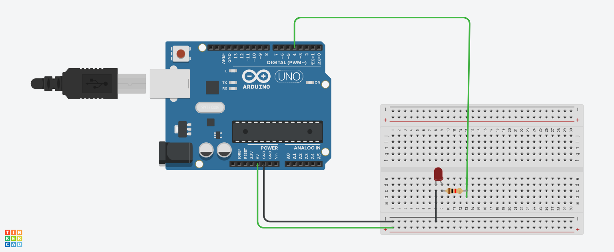

# LED

# Introdução
  O projeto consiste em ligar e desligar um LED azul em determinados intervalos de tempo.

## Materiais utilizados
- 1 Arduino uno
- 1 Protoboard 400 pontos
- 1 LED vermelho 3.3v
- 1 resistor de 1K Ohm

## Explicação do código

// C++ code
//comentários pequenos
/*comentários grandes */

// Variável para capturar a porta/pino de conexão do LED
int led = 4;

//Função para configuração inicial, roda 1 vez no início
void setup()
{
  // Definir configurações do LED INPUT (entrada) OUTPUT (saída)
  pinMode(led,OUTPUT); // Definir o led como saída
  
  /*
  Função de definição de entrada/saída do equipamento para receber 
  2 parametros :
  (porta que o dispositivo está conectado, OUTPUT)
  */
  
}

// Função de execução de intruções infinitas/loop
void loop()
{
  // Ligar o meu LED
  digitalWrite(led,HIGH);
  
  // Adicionar pausa
  delay (2000); // Espere 2 segundos com o LED ligado 
  
  // Desligar o LED, usa-se (LOW)
  digitalWrite(led,LOW);
  delay (2000);
  
}

## Imagem de montagem do circuito

