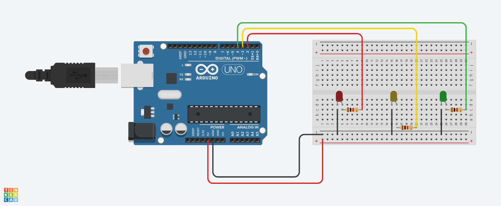

# LED de semaforo

## Introdução
 O projeto consiste em simular o funcionamento de semáforo, que se baseia em usar LEDs vermelho, amarelo e verde, cada um com um resistor e funciona analogamente ao semáforo real. Inicia o ciclo com vermelho para os carros pararem, verde para os carros seguirem, amarelo para os carros ficarem atentos ao sinal que esá prestes a ficar vermelho e finaliza o ciclo com o vermelho para os carros pararem. 
 
## Materiais utilizados
- 1 Arduino uno
- 1 Protoboard 400 pontos
- 1 LED vermelho 3.3v
- 1 LED amarelo 3.3v
- 1 LED verde 3.3v
- 3 resistores de 1K Ohm

## Explicação do código

// C++ code

// Variáveis dos LEDs
int ledVermelho = 4;
int ledAmarelo = 3;
int ledVerde = 2;

void setup() 
{ // Definir LEDs como saída
  pinMode(ledVermelho,OUTPUT);
  pinMode(ledAmarelo,OUTPUT);
  pinMode(ledVerde,OUTPUT);
}

void loop()
{
  //// Ligar o LED verde
  digitalWrite(ledVermelho,LOW);// Desligar vermelho
  digitalWrite(ledAmarelo,LOW);// Desligar amarelo
  digitalWrite(ledVerde,HIGH);// Ligar verde
  delay(2000); // Espere 2 segundos 
  
  // Ligar o LED vermelho
  digitalWrite(ledVermelho,HIGH);// Ligar vermelho
  digitalWrite(ledAmarelo,LOW);// Desligar amarelo
  digitalWrite(ledVerde,LOW);// Desligar verde
  delay(2000); // Espere 2 segundos 
  
   // Ligar o LED amarelo
  digitalWrite(ledVermelho,LOW);// Desligar vermelho
  digitalWrite(ledAmarelo,HIGH);// Ligar amarelo
  digitalWrite(ledVerde,LOW);// Desligar verde
  delay(1000); // Espere 1 segundo
}

## Imagem de montagem do circuito

