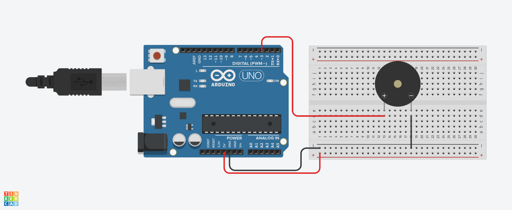

# Buzzer

# Introdução
  O projeto consiste em 

## Materiais utilizados
- 1 Arduino uno
- 1 Protoboard 400 pontos
- 1 

## Explicação do código

// C++ code

int buzzer = 3;
# define doo 262
# define re 294
# define mi 330
# define fa 349

void setup()
{
  pinMode(buzzer,OUTPUT);
}

void loop()
{
  
  // A função de ligar tone()
  tone (buzzer,doo,500); // Tocar o dó 
  delay(500); // Esperar por 600 millisecond(s)
  tone (buzzer,re,500); // Tocar o dó 
  delay(600); // Esperar por 600 millisecond(s)
  tone (buzzer,mi,500); // Tocar o dó 
  delay(600); // Esperar por 600 millisecond(s)
  tone (buzzer,fa,500); // Tocar o dó 
  delay(600); // Esperar por 600 millisecond(s)
  
  noTone(buzzer);
}

## Imagem de montagem do circuito

