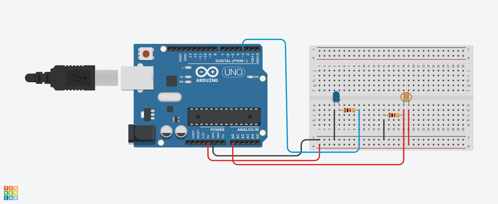

# Poste inteligente

## Introdução
 O projeto consiste num poste que tem a função automatizada a partir de um fotoresistor que detectar a falta de lunminosidade e dá o comando para a placa arduino acender o LED azul

## Materiais utilizados
1 Arduino uno
1 Protoboard 400 pontos
1 LED azul 3.3v
1 Fotoresistor 
2 resistores de 1K Ohm

## Explicação do código

// C++ code
// Variáveis
int led = 3 ;
int sensorluminosidade = A0;
// Variável para capturar a luminosidade
int luz = 0;

void setup()
{
 // LED é de saída
  pinMode(led,OUTPUT);
  //sensor é de entrada
  pinMode(sensorluminosidade,INPUT);
}

void loop()
{
 // Capturar o que o sensor leu no ambiente
 // analogRead é usado para leitura analogica
  luz = analogRead(sensorluminosidade);
  /* As portas analogicas capturam dados que 
  variam de 0 até 1023 */
  
  // Se estiver com pouca luz no ambiente 
  if(luz < 500){
    //digitalWrite(led,HIGH); // Ligar LED
    
    // Passar ao LED intensidade maxima
    analogWrite(led,1023);
  }if(luz>500 & luz<900){
    // Passar ao LED intensidade média
    analogWrite(led,500);
    
  }else{// Se tiver luz no ambiente
    //digitalWrite(led,LOW); // Desligar LED
    
    // Passar ao LED intensidade minima
    analogWrite(led,0);
  }
  
  
}

## Imagem de montagem do circuito

  
