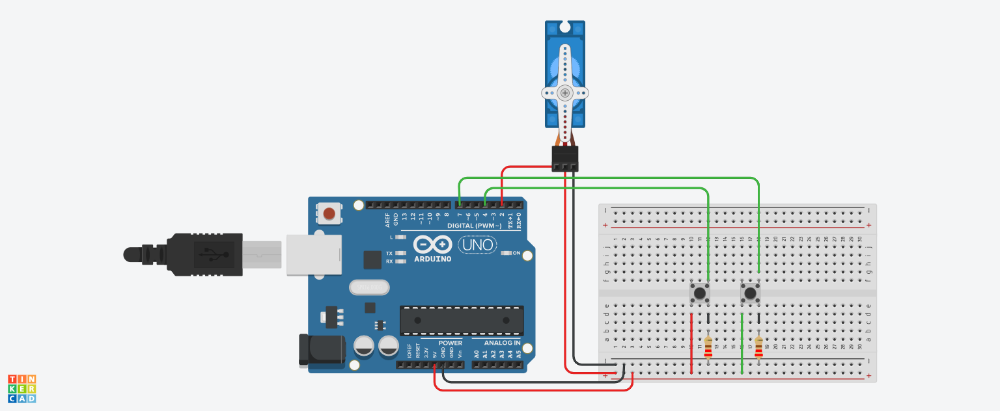

# Alarme com sensor PIR

# Introdução
  O projeto consiste em tocar um alarme através de um componente de saída de sinal que emite frequência sonora, o buzzer piezo. 
  Ele emite esse alarme quando o sensor PIR detecta algo ou alguém próximo do sistema. 

## Materiais utilizados
- 1 Arduino uno
- 1 Protoboard 400 pontos
- 1 piezo
- Sensor PIR

## Explicação do código

}

## Imagem de montagem do circuito

