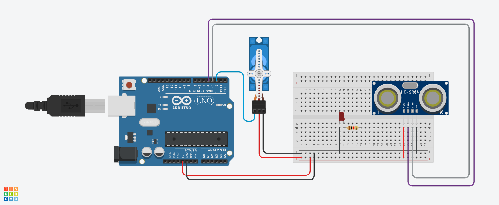

# Robô segurança

## Introdução

## Materiais utilizados
- 1 Arduino uno
- 1 Protoboard 400 pontos
- 1 LED vermelho 3.3v
- 1 resistor de 1K Ohm

## Explicação do código

// biblioteca do servo motor
#include <Servo.h>
/*criando objeto do tipo Servo Motor
para poder usar as funções de controle
do equipamento(servo motor) */
Servo objetoservo;
// variavel para salvar a porta que o servo está
int servo=2;

// variavel para posição do motor
int posicao =0;

// metodo para captar a distancia das pessoas
  long leituraDistancia(int triggerPin, int echoPin)
  {
    pinMode(triggerPin, OUTPUT);  
    digitalWrite(triggerPin, LOW);
    delayMicroseconds(2);

    digitalWrite(triggerPin, HIGH);
    delayMicroseconds(10); 
    digitalWrite(triggerPin, LOW);
    
    pinMode(echoPin, INPUT); 

    return pulseIn(echoPin, HIGH);
  }

void setup()
{
  //incializando o servo na porta digital 2
  objetoservo.attach(servo);
  // SERVO COMEÇA NA POSIÇÃO 0
  objetoservo.write(0);
  
}

void loop()
{
  //transformando o valor lido em centimetros
    int cm = 0.01723 * leituraDistancia(4,3);
  /* SE OBJETO FOR DETECTADO A MENOS DE 50 CM
  ENTÃO O MOTOR DE PASSO ROTACIONA 90 GRAUS*/
  if(cm<=50 && posicao>=0 ){
    // ENTÃO AUMENTE 90° DE POSIÇÃO 
    posicao+=90;
   // MANDE O MOTOR PARA A NOVA POSIÇÃO
    objetoservo.write(posicao);
   // AGUARDE 1 SEGUNDO PARA A PRÓXIMA LEITURA
    delay(5000); 
  }
  
  if(cm<=50 && posicao==360 ){
    // ENTÃO DIMINUI 90° DE POSIÇÃO 
    posicao-=90;
   // MANDE O MOTOR PARA A NOVA POSIÇÃO
    objetoservo.write(posicao);
   // AGUARDE 1 SEGUNDO PARA A PRÓXIMA LEITURA
    delay(5000); 
  }
  
}

## Imagem de montagem do circuito

