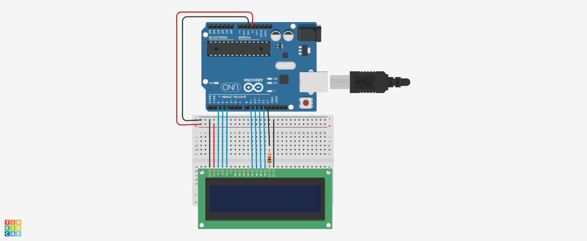

# Tela LCD

## Introdução

## Materiais utilizados
- 1 Arduino uno
- 1 Protoboard 400 pontos
- 1 Tela LCD 16 x2
- 1 Sensor de distância ultrassônico

## Explicação do código

// biblioteca do LCD
#include <LiquidCrystal.h> 
// criar variavel do lcd
LiquidCrystal lcd (2,3,4,9,10,11,12);
int ledLcd = 13;

void setup()
{
  pinMode(ledLcd,OUTPUT); // DEFINIR LED LCD SAIDA
  digitalWrite(ledLcd,HIGH); // ligar os LEDs do LCD
  lcd.begin(16,2); // informar que o lcd tem 16 colunas e 2 linhas
  lcd.clear(); // iniciar o lcd limpo
  
}

void loop()
{
  lcd.setCursor(0,0); // iniciar a escrita na linha 0 coluna 0
  lcd.print("Ola Mundo");
  lcd.setCursor(0,1); // iniciar a escrita na linha 0 coluna 1
  lcd.print("Bom dia!");
  
}

## Imagem de montagem do circuito

