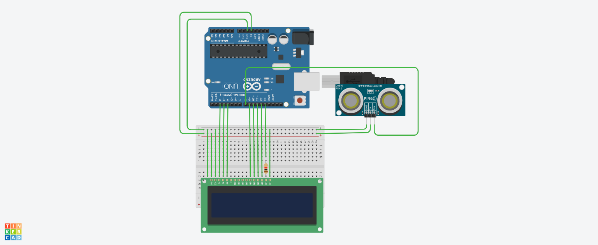

# Tela LCD com sensor de distância

## Introdução
  Este projeto consiste em avisar através de uma mensagem "Mantenha distância" que é mostrada no LCD através de uma detecção de proximidade do sensor no sistema. 

## Materiais utilizados
- 1 Arduino uno
- 1 Protoboard 400 pontos
- 1 Tela LCD 16 x2
- 1 Sensor de distância ultrassônico

## Explicação do código

// biblioteca do LCD
#include <LiquidCrystal.h> 
// criar variavel do lcd
LiquidCrystal lcd (2,3,4,9,10,11,12);
int ledLcd =13;

// Método para capturar a distaância
// Retorna o número quebrado longo

long distancia(int trigger, int echo){
  // Trigger porta de saída
  pinMode(trigger,OUTPUT);
  digitalWrite(trigger,LOW);
  delay(5); // Espere 5 milisegundos
  // Mandando o sinal
  digitalWrite(trigger,HIGH);
  delay(10); // Espere 10 milisegundos
  digital Write(trigger,LOW); // Desligar porta 
  // Echo porta de entrada
  pinMode(echo,INPUT); // Definir porta como entrada
  // Retorna os dados que a porta recebe
  return pulseIn(echo,HIGH);
  
}
void setup()
{
  pinMode(ledLcd,OUTPUT); // DEFINIR LEDLCD SAIDA
  digitalWrite(ledLcd, HIGH); // ligar os LEDs do LCD
  lcd.begin(16,2); // informar que o lcd tem 16 colunas e 2 linhas
  lcd.clear(); // iniciar o lcd limpo
}else{// Senão
  lcd.clear(); // Apague todas as mensagens do display

}

void loop()
{
  // Transformar o valor recebido para centímetros
  int cm = 0.01723 * distancia(8,8);
  
  if(cm<100){// Se a distância for menor do que 1 metro
    
  lcd.setCursor(0,0); // iniciar a escrita na linha 0 coluna 0
  lcd.print("MANTENHA");
  lcd.setCursor(0,1); // iniciar a escrita na linha 0 coluna 0
  lcd.print("DISTÂNCIA!");
  
}

## Imagem de montagem do circuito

